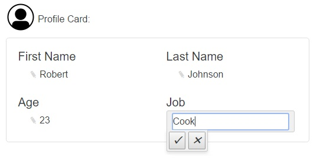

# Angular 2 Click-To-Edit
##Click on a data-binding to make it an input field, and save the changes!


## Examples:
- Plunker Example - http://plnkr.co/edit/4dGYAe?p=info 

## Newly Added!

- Easy permission enabling/disabling edit functionality. 
- Easy to attach Field-Validation. 

## This Version Has:

- Easy to implement component to wrap your bindings.
- onSave event that calls your own save method.
- Nice looking css style(inspired by Jira)
- Canceling method when choosing to cancel or when clicking outside.

## Installation
```
    npm install angular2-click-to-edit
```

# How To Use:  

## Adding package to SystemJS:
systemjs.config.js
```
 var map = {
	'angular2-click-to-edit': 'node_modules/angular2-click-to-edit',
	}
```
```
 var packages = {
	'angular2-click-to-edit': { main: 'index' }  
 }
```

## Step 1:
component.ts
```
 // Import to the component where you want to implement the click-to-edit.
 import { NDV_DIRECTIVES } from 'angular2-click-to-edit/components';

 // Include it in the Component directives
 @Component({
 	 directives: [NDV_DIRECTIVES]
 })

```

## Step 2:
page.html  
```
<!- This is your uneditible regular binding: ->
<p>{{user.firstName}}</p>

<!- This is your EDITABLE binding: ->
<p><ndv-edit [title]="'firstName'" [placeholder]='user.firstName' (onSave)='yourSaveMethod($event)'></ndv-edit></p>
```
# Important Notes!
 As you can see there are few parameters passed:
- [title] - this is the name of the field you want to send back to the server. i.e: "email".

- [placeholder] - this is the text that will be displayed by default(before editing)
		  so we would probably like to bind our data to it.

- [min] - this one is similar to minlength(for validation) and can set the minimum requirement of chars.

- [max] - this one is similar to maxlength(for validation) and can limit the number of chars.

-[regex] - this one is similar to pattern(for validation) and can use regular expressions.

- [permission] - a simple attribute, once equal to false the edit field is changed to read-only. 

- (onSave) - this one takes the function you give it and 
	     call it when the user saved his edited info!

# VERY IMPORTANT TO NOTICE 
$event - is the object containing the information based on the [title]!!! 
- for instance: [title]="firstName"*
  then $event = { firstName: 'the user edited text' }.


## Thanks
 - for this awesome tutorial by Ben Nadel - http://www.bennadel.com/blog/3009-tracking-click-events-outside-the-current-component-in-angular-2-beta-1.html 
